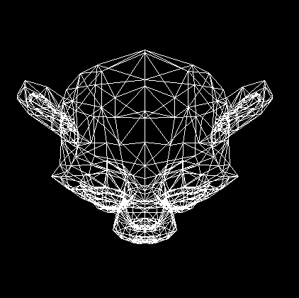
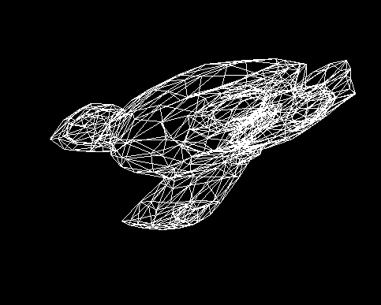
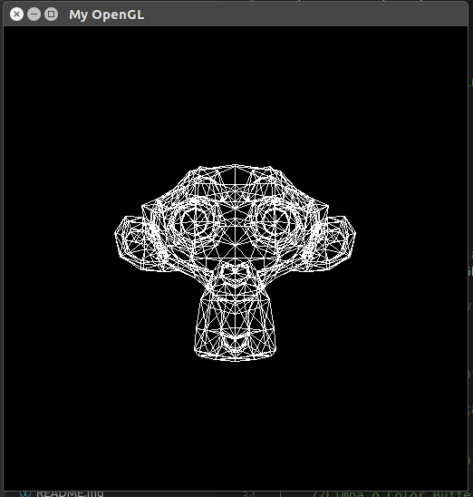

# Computer-Graphics-UFPB
---

# Menu
* [Introdução](#introdução)
	* [Objetivo](#objetivo)
* [Estágios do Pipeline Gráfico](#estágios-do-pipeline-gráfico)
	* [1. Transformação: Espaço do Objeto → Espaço do Universo](#1.-transformação:-espaço-do-objeto-→-espaço-do-universo)
		* [Rotação](#rotação)
		* [Escala](#escala)
		* [Cisalhamento (Shear)](#cisalhamento-(shear))
	* [2. Transformação: Espaço do Universo → Espaço da Câmera](#2.-transformação:-espaço-do-universo-→-espaço-da-câmera)
	*	[3. Transformação: Espaço da Câmera → Espaço Projetivo ou de Recorte](#3.-transformação:-espaço-da-câmera-→-espaço-projetivo-ou-de-recorte)
	*	[4. Transformação: Espaço de Recorte → Espaço “Canônico"](#4.-transformação:-espaço-de-recorte-→-espaço-“canônico”)
	*	[5. Transformação: Espaço “Canônico” → Espaço de Tela](#5.-transformação:-espaço-“canônico”-→-espaço-de-tela)
*	[Criação do Pipeline Gráfico](#criação-do-pipeline-gráfico)
*	[Resultados](#resultados)
*	[Conclusão](#conclusão)
*	[Referências](#referências)
---


# Introdução 

O pipeline gráfico é um dos conceitos essenciais da Computação Gráfica, é importante entendê-lo para dominar as APIs gráficas OpenGL e DirectX, pois diversas funções destas API's agem sobre diferentes estágios do pipeline e a compreensão das etapas do pipelines farão o usuário ter uma melhor experiência ao utilizar estas API's.


## Objetivo

Através da implementação de um pipeline gráfico, iremos compreender melhor cada um dos processos que ocorrem até que os modelos geométricos cheguem até a tela. Ainda conheceremos com mais detalhes as dificuldades que ocorrem entre as transições e que estratégias podem ser utilizadas para superar tais dificuldades. Com estes conhecimentos, iremos ser capazes de conhecer com mais clareza as ferramentas gráficas que temos atualmente e acrescentar uma melhor experiência ao utilizá-las. 

# Estágios do Pipeline Gráfico

O pipeline gráfico consiste exatamente de uma sequência de passos necessários para transformar uma descrição geométrica/matemática de uma cena 3D em uma descrição visual na tela 2D. A imagem final é obtida por meio da rasterização das primitivas projetadas na tela. Basicamente, cada passo do pipeline gráfico consiste de uma transformação geométrica de um sistema de coordenadas (espaço) para outro, são eles :

<p align="center">
	<br>
	
	<h5 align="center">Figure 1 - pipeline</h5>
	<br>
</p>

Para a parte de rasterização será utilizado a implementação referente ao trabalho 1 com algumas alterações para o uso no trabalho 2.

## 1. Transformação: Espaço do Objeto → Espaço do Universo

Esta etapa do pipeline é responsável por transformar vértices, originalmente descritos no
espaço do objeto, para o espaço do universo. Isto é feito através da multiplicação destes
vértices por uma matriz denominada matriz de modelagem (ou model matrix). A matriz
de modelagem é composta por uma sequência de transformações geométricas que
posicionam o modelo no universo. As transformações que podem compor a matriz de
modelagem são a rotação, translação, escala e o cisalhamento (shear).

<p align="center">
	<br>
	
	<h5 align="center">Figure 2 - Espaço do objeto</h5>
	<br>
</p>


## Rotação

As rotações podem ser feitas nos três eixos de coordenadas, portanto seria necessário criar uma matriz para cada um dos tipos de rotação. Contudo, analisando a rotação em um dois eixos, é possível com algumas mudanças determinar as equações que irão rotacionar os vértices nos outros eixos.

Mas também podemos fazer isto para todos os eixos, misturando as rotações, rotacionando um objeto um pouco no eixo Y, depois em X e depois em Z.

Para calcular as novas posições dos vertices, também podemos escrever o valor de x de um vértice, pela distância dele até a origem multiplicada pelo cosseno do ângulo formado entre o vetor e o eixo X. O mesmo ocorre com o y de um vértice, que pode ser escrito pela distância multiplicada pelo seno do ângulo.

<p align="center">
	<br>
	
	<h5 align="center">Figure 3 - Rotacao do objeto</h5>
	<br>
</p>

Agora iremos rotacionar os vértices que desejamos:

<p align="center">
	<br>
	
	<h5 align="center">Figure 4 - Rotacao dos vertices</h5>
	<br>
</p>

Os calculos são os seguintes:

<p align="center">
	<br>
	
	<h5 align="center">Figure 5 - Calculo de Rotacao</h5>
	<br>
</p>

E por fim teremos os resultados:

<p align="center">
	<br>
	
	<h5 align="center">Figure 6 - Modelo Rotacao</h5>
	<br>
</p>

No codigo faremos o seguinte para a rotação em X:


```C++
	//Matriz de Rotação
	rotateGL(angle, 1.0f, 0.0f, 0.0f);
```

E obteremos:


<p align="center">
	<br>
	
	<h5 align="center">Figure 7 - Rotacao</h5>
	<br>
</p>

Em Y de forma analoga:


```C++
	//Matriz de Rotação
	rotateGL(angle, 0.0f, 1.0f, 0.0f);
```

Para rotacionar em ambos, primeiro rotacionamos no eixo X e dps no eixo Y assim:


```C++
	//Matriz de Rotação
	rotateGL(angle, 0.0f, 1.0f, 0.0f);
	rotateGL(angle, 1.0f, 0.0f, 0.0f);
```

## Escala

Escalonar significa redimensionar um objeto, ou seja, aumentar ou diminuir suas dimensões, deformá-lo ou até mesmo espelhá-lo.  Para fazer isso, basta multiplicar os valores das coordenadas de um vértice por um fator de escala - lembrando que as coordenadas de um vértice possuem valores inteiros para X, Y e Z no modelo 3D e para X e Y no modelo 2D. Essa operação de multiplicação deve ser feita para todos os vértices do objeto. Ao longo da postagem, vamos adotar a seguinte notação : vetor transformado = matriz de transformação x vetor original. Cada vetor é uma generalização para os vértices do objeto. 

Matriz de escala:


```C++
//Matriz de escala
void scaleGL(double x, double y, double z)
{
    Matrix scale(4, 4);
    
    scale.loadIdentity();
    
    scale.setValue(0, 0, x);
    scale.setValue(1, 1, y);
    scale.setValue(2, 2, z);
    
    matrix_model.mult(matrix_model, scale);
}
```

## Cisalhamento (Shear)

Uma outra forma de deformar os objetos de uma cena seria aplicando esta transformação. O shear  mantém uma coordenada U fixa enquanto muda a coordenada V ao longo de seu eixo, ou seja, há uma relação linear entre V e U.


<p align="center">
	<br>
	
	<h5 align="center">Figure 8 - Shear</h5>
	<br>
</p>

Matriz de Cisalhamento:


```C++
//Matriz de shear
void shearGL(double x, double y, double z)
{
    Matrix shear(4, 4);
    shear.loadIdentity();

    shear.setValue(0, 1, x);
    shear.setValue(0, 2, x);

    shear.setValue(1, 0, y);
    shear.setValue(1, 2, y);

    shear.setValue(2, 0, z);
    shear.setValue(2, 1, z);

    matrix_model.mult(matrix_model, shear);
}
```


Aplicando cisalhamento no eixo X:

<p align="center">
	<br>
	
	<h5 align="center">Figure 9 - Shear no objeto</h5>
	<br>
</p>

# 2. Transformação: Espaço do Universo → Espaço da Câmera


<p align="center">
	<br>
	
	<h5 align="center">Figure 10 - Espaço da camera</h5>
	<br>
</p>

Aqui é definido como a cena será vista, então, faz-se necessário configurar a câmera. A câmera possui 3 dados importantes que devem ser descritos:

- Posição da Câmera: Local onde ela se encontra
- Direction: Local para onde a câmera está "olhando"
- Up: Fixa a câmera no eixo determinado

Assim, é criado o código que representa a Criação da Câmera:


```C++
//Criação da Câmera
void createCamera(
		double pos_x, double pos_y, double pos_z,
		double lookat_x, double lookat_y, double lookat_z,
		double up_x, double up_y, double up_z
		)
{
  Vector x_cam(3, 1);
  Vector y_cam(3, 1);
  Vector z_cam(3, 1);

  Matrix Bt(4, 4);
  Matrix T(4, 4);
  
  Vector aux(3, 1);
  Vector up(3, 1);

  double vec_pl[] = {pos_x - lookat_x, pos_y - lookat_y, pos_z - lookat_z};
  double vec_up[]  = {up_x, up_y, up_z};
    
  aux.setValues(vec_pl);
  up.setValues(vec_up);
    
  z_cam.div(aux, norm(&aux));
  cross(&up, &z_cam, &aux);
    
  x_cam.div(aux, norm(&aux));
  cross(&z_cam, &x_cam, &aux);
  y_cam.div(aux, norm(&aux));
    
  double bt_mtx[] = {
    x_cam.getValue(0, 0), x_cam.getValue(1, 0), 
    x_cam.getValue(2, 0), 0, 
    y_cam.getValue(0, 0)y_cam.getValue(1, 0), y_cam.getValue(2, 0),
    0,z_cam.getValue(0, 0),
    z_cam.getValue(1, 0),z_cam.getValue(2, 0),
    0,0,0,0,1
  };
    
    Bt.setValues(bt_mtx);
    T.loadIdentity();
    T.setValue(0, 3, -pos_x);
    T.setValue(1, 3, -pos_y);
    T.setValue(2, 3, -pos_z);
    matrix_view.loadIdentity();
    matrix_view.mult(Bt, T);
}
```

Abaixo, é feito a parte que corresponde a essa etapa, o vertice, que agora possui os dados da etapa anterior, é multiplicado com a matriz view, criada para ser usada nessa etapa:


```C++
vertice.mult(matrix_view, vertice);
```

Inicialização da camera:

```C++
	//Cria a câmera
	createCamera(
		0.0f, 0.0f, 5.0f,	// posição da câmera
		0.0f, 0.0f, 0.0f,	// ponto para o qual a camera está olhando
		0.0f, 1.0f, 0.0f	// vetor "up"
	);
```

# 3. Transformação: Espaço da Câmera → Espaço Projetivo ou de Recorte

Até agora já percorremos metade do pipeline gráfico. Esta terceira etapa consiste em transformar vértices do espaço da câmera para o espaço de recorte (ou projetivo) e mais uma vez iremos construir uma matriz, a matriz de projeção (projection matrix). Dada a seguinte situação :

<p align="center">
	<br>
	
	<h5 align="center">Figure 11 - Espaço de recorte</h5>
	<br>
</p>

É interessante ressaltar que é nessa etapa onde ocorre a distorção perspectiva - objetos mais próximos do view plane aparentam ser maiores do que objetos que estão mais distantes.

Assim, é criado o código que representa a Matriz de Projeção:

Criação do View Plane - Matriz Projection:


```C++
//Criação da ViewPort
void viewportGL(int x, int y, size_t width, size_t height)
{
    Matrix S1(4, 4);
    Matrix S2(4, 4);
    Matrix T(4, 4);

    S1.loadIdentity();
    S2.loadIdentity();
    T.loadIdentity();
    
    S1.setValue(1, 1, -1);
    
    S2.setValue(0, 0, (width - 1) / 2.0f);
    S2.setValue(1, 1, (height - 1) / 2.0f);
    
    T.setValue(0, 3, 1);
    T.setValue(1, 3, 1);
    
    matrix_viewport.loadIdentity();
    
    matrix_viewport.mult(T, S1);
    matrix_viewport.mult(S2, matrix_viewport);
}
```

Com a matriz de projeção criada, multiplica-se agora com resultado da etapa anterior, da seguinte forma:


```C++
vertice.mult(matrix_projection, vertice);
```


# 4. Transformação: Espaço de Recorte → Espaço “Canônico”

<p align="center">
	<br>
	
	<h5 align="center">Figure 12 - Espaço de recorte para canonico</h5>
	<br>
</p>

Esta etapa do pipeline é responsável por transformar pontos do espaço de recorte para o
espaço canônico (ou NDC – Normalized Device Coordinates). Isto é feito em duas
etapas. Primeiro, dividem-se as coordenadas dos vértices no espaço de recorte pela sua
coordenada homogênea. Esta transformação gera uma alteração da geometria da cena,
tornando menores os objetos que estiverem mais distantes da câmera. Adicionalmente,
esta transformação mapeia o volume de visualização (view frustum), com formato
piramidal, em um hexahedro. A seguir, os vértices são multiplicados por uma matriz
adicional que, ao aplicar escalas e translações, transforma estes vértices para o espaço
canônico, transformando o hexahedro anterior em um cubo de coordenadas unitárias e
centrado na origem.


Aqui ocorre a homogeneização, que no caso, significa dividir todos os componentes do vértice pela sua coordenada homogênea. Então, para fazer a divisão, fazemos o seguinte:


```C++
vertice.div(vertice, vertice.getValue(3, 0));
```


Como pode notar no código, é pego o último elemento, que é a coordenada homogênea, e assim, dividimos pelo resultado da etapa anterior, terminando essa etapa.

# 5. Transformação: Espaço “Canônico” → Espaço de Tela

<p align="center">
	<br>
	
	<h5 align="center">Figure 13 - Espaço de canonico para tela</h5>
	<br>
</p>

Esta etapa do pipeline é responsável por transformar pontos do espaço canônico para o
espaço de tela. Isto é feito através da multiplicação dos vértices por uma matriz
específica que envolve escalas e translações.

Aqui é utilizado o viewport, onde aqui os vértices do espaço canônico é mapeado para o espaço da tela. Para isso ocorrer, deve-se lembrar que os valores são arredondados, pois a tela possui apenas coordenadas inteiras.

Então, eis o código que representa a Matriz Viewport:

Criação da Tela - Matriz Viewport
```C++
//Criação da ViewPort
void viewportGL(int x, int y, size_t width, size_t height)
{
    Matrix S1(4, 4);
    Matrix S2(4, 4);
    Matrix T(4, 4);

    S1.loadIdentity();
    S2.loadIdentity();
    T.loadIdentity();
    
    S1.setValue(1, 1, -1);
    
    S2.setValue(0, 0, (width - 1) / 2.0f);
    S2.setValue(1, 1, (height - 1) / 2.0f);
    
    T.setValue(0, 3, 1);
    T.setValue(1, 3, 1);
    
    matrix_viewport.loadIdentity();
    
    matrix_viewport.mult(T, S1);
    matrix_viewport.mult(S2, matrix_viewport);
}
```

Com a viewport criada, ocorre a multiplicação da etapa anterior com a viewport:


```C++
vertice.mult(matrix_viewport, vertice);
```


# Criação do Pipeline Gráfico


Esta parte consiste em mostrar como foi juntar os trechos anteriores em apenas uma função, comentando qual etapa corresponde a qual linha do código. Para isso, veja o código a seguir:

```C++
//Criação do Pipeline
Point createPipeline(double x, double y, double z)
{
    double vert[] = {x, y, z, 1};
    Matrix vertice(4, 1);
    vertice.setValues(vert);

    vertice.mult(matrix_model, vertice);
    vertice.mult(matrix_view, vertice);
    vertice.mult(matrix_projection, vertice);
    vertice.div(vertice, vertice.getValue(3, 0));
    vertice.mult(matrix_viewport, vertice);

    Point p = {.x = (int)vertice.getValue(0, 0), .y = (int)vertice.getValue(1, 0)};
    
    return p;
}
```

# Resultados

Aqui poderemos comparar o resultado obtido com o resultado do loader disponibilizado pelo professor.

<p align="center">
	<br>
	
	<h5 align="center">Figure 14 - Loader do professor</h5>
	<br>
</p>

<p align="center">
	<br>
	
	<h5 align="center">Figure 15 - Gerado pelo Pipeline</h5>
	<br>
</p>

# Conclusão

Com a implementação do pipeline podemos colocar em prática os conhecimentos obtidos na disciplina e entender melhor o funcionamento do mesmo.

#	Referências

*	Notas de Aula do Professor Christian A. P.
